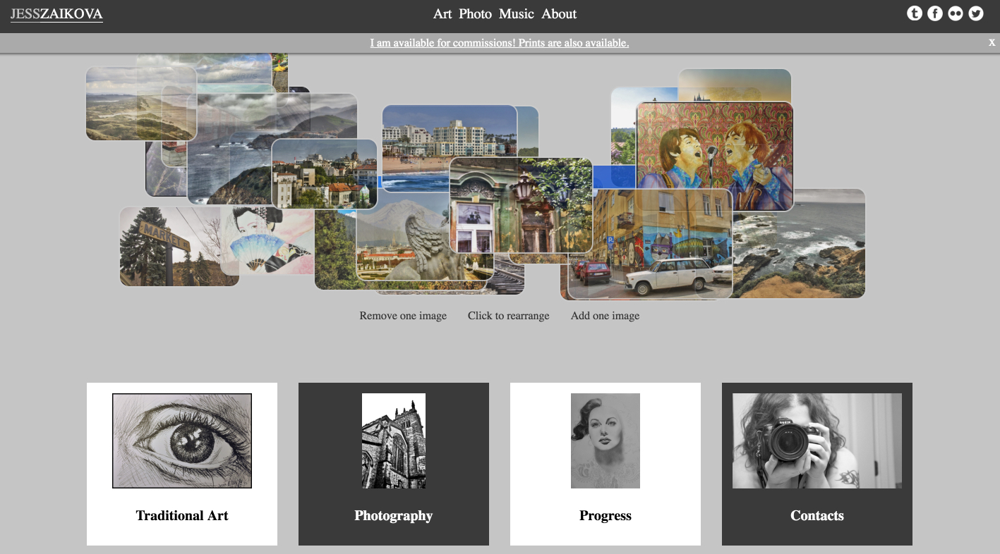

# Overview

[](https://travis-ci.org/JessArt/website)

This is a source code for web application at [jess.gallery](http://jess.gallery).



There is no sensitive information in this repository, so it is fully opened – feel free to run and play with it. Unfortunately, there is no documentation for API, but you can look at the code [here](https://github.com/JessArt/CMS-API).

## Start

```shell
npm run start # starts a webpack-dev-server
```

There is also a nodemon if you want to serve files from actual express.js server, like in production, but I don't feel it is a super helpful feature (it adds some delay).

To build the project:
```shell
npm run build:prod
```

## Linting

I use [eslint](https://github.com/eslint/eslint) with fully custom rules. It can be run via command:
```shell
npm run eslint
```

## Testing

I use [ava](https://github.com/avajs/ava) library. For now there are almost no tests, because components and the single store are the only subjects for testing.

```shell
npm run test
```

## Libraries

This is an isomorphic application built in React.js, with dynamic prefetch of needed resources, for better mobile access and SEO. It uses [mobx](https://github.com/mobxjs/mobx) instead of de-facto standard [Redux](https://github.com/reactjs/redux) approach, due to my interest to this technology and also due to the fact, that this should be quite small project – so far it shows itself as much more lightweight and less strict solution.

For bundling I use webpack and webpack-dev-server for development, which with [react hot reload preset](https://github.com/danmartinez101/babel-preset-react-hmre) gives wonderful development experience.
I use PostCSS mostly out of curiousity, because I feel that all modern CSS processors are capable about basically the same possilities. Maybe PostCSS is more flexible, but definitely it requires more setup.
